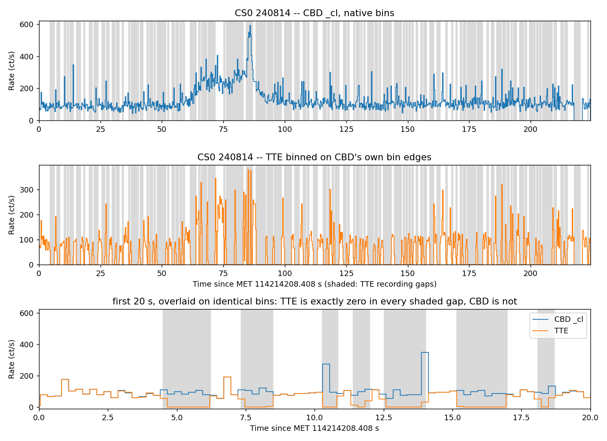

================
GDT-BurstCube
================

GDT-BurstCube is an extension to the Gamma-ray Data Tools (GDT) that adds
readers, finders, and a detector response interface for the BurstCube
mission: continuous binned data (CBD), time-tagged events (TTE), the
detector response grid, orbit/attitude, detector housekeeping, the mission
timeline, and the ``burcbmastr`` observation catalog.

Normal Installation
--------------------

If you don't plan to contribute code to the project, the recommended install
method is installing from PyPI using:

.. code-block:: sh

   pip install astro-gdt-burstcube
   gdt-data init

The ``gdt-data init`` is required to initialize the library after installation
of astro-gdt. You do not need to perform the initialization again if
astro-gdt was already installed and initialized. There is no harm in running
it again "just in case".

Quickstart
----------

.. code-block:: python

   from gdt.missions.burstcube.finders import BurstCubeObsFinder
   from gdt.missions.burstcube.cbd import BurstCubeCBD

   # find and download the cleaned CBD file for one detector, one day
   finder = BurstCubeObsFinder('240530')
   paths = finder.get_cbd('./data', detectors='CS0', variant='cl')

   cbd = BurstCubeCBD.open(paths[0])
   lc = cbd.to_lightcurve()

See the Jupyter notebooks (inside docs/notebooks)
for three complete, executed worked examples against the live archive: data
types and binning, detector response, and ancillary data (orbit, attitude,
GTI/SAA, housekeeping, timeline, catalog).

**Read the Caveats section below before drawing conclusions from BurstCube
data** -- several of the mission's real quirks are not obvious from the API
alone.

================
Caveats
================

BurstCube public archive has some
rough edges. This toolkit works around what it safely can and documents the
rest here. This section covers the issues most likely
to affect analysis. It is not exhaustive, see the official caveats list
`BurstCube Archive Caveats <https://heasarc.gsfc.nasa.gov/docs/burstcube/archive/burstcube_archive_caveats.pdf>`_
document (2025-07-22).

Response EBOUNDS mismatch
--------------------------

A ``.rsp`` file's own internal ``EBOUNDS`` extension is an **older, rounded,
detector-independent** energy grid -- it is not the same grid CALDB uses for
CBD's 16-channel data, and not the same for every detector. For example, on
CS0:

.. code-block::

   .rsp EBOUNDS  top channel:  1290.00 -- 5000.00 keV   (same for all 4 detectors)
   CALDB eb16    top channel:  1298.79 -- 1648.51 keV   (CS0-specific)

The channel **grouping** (which of the native 64 channels combine into each
of CBD's 16) is identical between the two grids -- only the energies differ.
Because of this, ``BurstCubeRsp.to_cbd()``
regroups channels **by index** and then replaces the channel energies with
CALDB's per-detector ``eb16``, discarding the ``.rsp``'s own EBOUNDS
energies entirely. If you fold a spectrum through a 16-channel response and
report channel energies, make sure you are reporting CALDB's, not the
``.rsp`` file's own.

Attitude is unavailable for most of the mission
--------------------------------------------------

Real, reconstructed attitude information exists for only **3** brief epochs
across the entire archive (``trend/attitude/bc_csa_att.fits``), each with an
approximate 10-12 degree 1-sigma pointing error. The detector response grid
is defined in spacecraft coordinates, so **without attitude you cannot place
a source on the sky** -- there is no way to convert a sky position into a
response pixel, or vice versa, for the other ~86 days.

The documented, supported path for every other time is to supply your own
independently reconstructed attitude quaternion via
``BurstCubeFrame.from_quaternion()``. Asking
for a sky-position response without one raises a clear error rather than
silently assuming an orientation.

TTE TSTART/TSTOP are unusable in every file
-------------------------------------------------------------

The ``EVENTS`` extension's ``TSTART``/``TSTOP`` keywords cannot be trusted in
**any** of the archive's 28 TTE files (7 observation days x 4 detectors). Two
distinct problems, verified by reading all 28:

* **All 28** store ``TSTART``/``TSTOP`` as FITS *strings* rather than numbers,
  and in all 28 ``TSTOP - TSTART`` disagrees with the file's own ``ONTIME``.
* **16 of the 28** additionally have ``TSTOP < TSTART``, which makes ``TELAPSE``
  and ``EXPOSURE`` negative and leaves the primary header's ``DATE-END``
  *earlier* than its ``DATE-OBS``.

Which files are affected, by observation day (all four detectors behave the
same way within a day):

.. list-table::
   :header-rows: 1
   :widths: 14 12 18 18 38

   * - Day
     - Files
     - ``TSTOP - TSTART``
     - ``ONTIME`` (s)
     - Problems
   * - 240530
     - 4
     - -15.6 s
     - 295.06 - 295.07
     - strings, ``TSTOP < TSTART``, negative exposure
   * - 240602
     - 4
     - -291.3 s
     - 440.05 - 440.06
     - strings, ``TSTOP < TSTART``, negative exposure
   * - 240628
     - 4
     - +38.2 s
     - 65.21 - 65.22
     - strings, span disagrees with ``ONTIME``
   * - 240629
     - 4
     - +100.4 s
     - 244.53 - 244.55
     - strings, span disagrees with ``ONTIME``
   * - 240813
     - 4
     - -472.5 s
     - 3179.04
     - strings, ``TSTOP < TSTART``, negative exposure
   * - 240814
     - 4
     - +44.0 s
     - 224.26 - 224.28
     - strings, span disagrees with ``ONTIME``
   * - 240815
     - 4
     - -16.8 s
     - 282.79 - 282.81
     - strings, ``TSTOP < TSTART``, negative exposure

What *is* reliable: the ``STDGTI`` extension's ``START``/``STOP`` reproduce the
span of the actual event times exactly (to 0.000 s) in all 28 files, and
``ONTIME`` agrees with that span to better than a millisecond. ``BurstCubeTTE``
therefore ignores ``TSTART``/``TSTOP`` entirely and derives the time range from
``STDGTI`` and the events, emitting a ``UserWarning`` when the keywords are
self-contradictory. If you read TTE headers directly rather than through this
reader, do the same.

Note that this problem is **not** described in the official caveats document.
Its caveat #4 concerns how few TTE files were downlinked, and caveat #5 the
2024-08-15 timeline alignment; neither mentions the header keywords. (Caveat #4
also says 34 TTE files of 100 s duration were downlinked, where the archive
holds 28 files whose durations run from 65 s to 3179 s.)

TTE gaps
--------

TTE does not cover its nominal span continuously. Event times arrive in
short **recording blocks** separated by gaps of comparable length, and
across a gap the event list is simply empty. A TTE-only light curve
therefore reads zero over much of the span. This likely is due to dropped TTE packets.

CBD is the same detector and the same event stream -- binned on board
rather than written out event by event -- so it is the reference for what
TTE should have contained, and it runs continuously through the gaps. On
2024-08-14, detector ``CS0``, splitting the event times wherever the gap
to the next event exceeds 0.5 s gives 94 blocks and 93 gaps. Binning TTE on
the **cleaned** (``_cl``) CBD file's *own* bin edges, and keeping the bins
that fall entirely inside one block or entirely inside one gap, so the two
samples are disjoint and each bin is the same 0.256 s interval for both:

.. code-block::

   inside a TTE block   284 bins    72.70 s   CBD 121.9 ct/s   TTE 118.3 ct/s
   inside a TTE gap     395 bins   101.12 s   CBD 131.3 ct/s   TTE   0.0 ct/s

         recording gaps shaded. TTE reads exactly zero in every shaded
         interval while CBD continues at its normal rate.
   :width: 100%

The figure is the output of ``examples/tte_gaps_vs_cbd.py``: the top two
panels are the full 224 s span with the 93 gaps shaded, and the bottom panel
overlays the first 20 s. Both panels are on CBD's bin edges, so they can be
read against each other bin for bin. TTE is zero in every bin that lies
inside a shaded interval; CBD is not.

Inside the gaps CBD counts at the *same* rate as inside the blocks --
the difference is likely due to numerical resolution errors -- while TTE records nothing at all over 101 s.
At TTE's own in-block rate those 101 s should have held roughly twelve
thousand events.

Inside the blocks the totals differ by 3% (121.9 against 118.3 ct/s), and
that residual is **not** a binning artifact: the bins above are already
CBD's own, so there are no edges to align. It is the same loss as the gaps,
seen at a finer grain. Split the in-block bins by their CBD rate:

.. code-block::

       0-100  ct/s   126 bins  32.26 s   CBD  2650   TTE  2652   ratio 0.9992 +/- 0.0274
     100-200  ct/s   123 bins  31.49 s   CBD  3858   TTE  3861   ratio 0.9992 +/- 0.0227
     200-300  ct/s    29 bins   7.42 s   CBD  1837   TTE  1718   ratio 1.0693 +/- 0.0359
     300-inf  ct/s     6 bins   1.54 s   CBD   515   TTE   369   ratio 1.3957 +/- 0.0952

Below 200 ct/s the two agree to 0.08%, which is as close as the counting
statistics can resolve. All 260 counts of the deficit come from the 35 bins
above 200 ct/s, which are 9 s of the 73 s. So TTE loses events in the
brightest bins as well as losing whole blocks, and a TTE light curve
understates a bright interval even where it is recording.

The instrument housekeeping, however, reports ``TTE_ENABLED = 1`` at every sample spanning the
window, so it is not a simple capture on/off -- though at the 30 s
``DETECTOR_HK1`` cadence that flag cannot resolve blocks and gaps that are
themselves around a second long.

``BurstCubeTTE.recording_blocks()`` finds the blocks for you and returns
them as a ``Gti``; the gaps are then
``gdt.missions.burstcube.gti.complement(blocks, *tte.time_range)``. The
script above is self-contained -- it downloads the two files it needs -- and
the notebook ``docs/notebooks/1_data_types_and_binning.ipynb`` works the
same data through the plugin's binning API.

This problem is **not** described in the official caveats document either.

CALDB SAA polygon: X is latitude, Y is longitude
-------------------------------------------------------------

``bcf/saa/bccsa_saareg_20230101v001.fits`` defines the SAA boundary as a
19-vertex polygon in two columns, ``X`` and ``Y``. Its own header comments
label them:

.. code-block::

   TTYPE2 = 'X'   / Satellite Earth Longitude
   TTYPE3 = 'Y'   / Satellite Earth Latitude

**The labels are the wrong way round.** Read as written, ``Y`` reaches
-94.3 degrees, which is 4 degrees past the south pole, and the polygon
becomes a narrow band off the coast of Brazil that the orbit crosses at the
wrong times. Read with ``X`` as latitude and ``Y`` as East longitude, it
spans 53.6S-2.0N by 94.3W-33.9E -- the South Atlantic Anomaly.

An independent check settles it: the first 11 vertices are numerically
identical to Fermi GBM's ``GbmSaaPolygon5``
(``gdt.missions.fermi.gbm.saa``), where the same numbers are stored in
lists named ``_latitude`` and ``_longitude``, and they line up with ``X``
and ``Y`` in that order. BurstCube's polygon is GBM's, extended by 8 more
vertices to the west.

The file also leaves the polygon **open** -- the 19th vertex does not repeat
the first -- so plotting the columns directly draws a broken outline.

``gdt.missions.burstcube.caldb.saa_region`` reads the columns in the
corrected order, and ``BurstCubeSaa`` appends a 20th vertex to close the
polygon. Closing it changes no containment result, since
``matplotlib.path.Path`` closes an open polygon implicitly; it only affects
what is drawn and what ``is_closed()`` reports. If you read the file
yourself rather than through this plugin, swap the columns.

Timeline UTC column is 37 seconds off its own MET column
-------------------------------------------------------------

``trend/timeline/*_timeline_final.csv`` has three columns and no header row:
a MET, a human-readable UTC string, and an event description.

.. code-block::

   106367555.28030825,2024-05-16T02:31:58.280,Spacecraft Reboot

**The UTC string is 37 seconds earlier than the MET on the same row.** The
MET is correct; the UTC string is not.

*Why there should be no offset at all.* BurstCube MET is defined by
``MJDREFI=59215``, ``MJDREFF=0.00080074074074074``, ``TIMESYS='TT'``. That
fraction is 69.184 s = 32.184 (TT-TAI) + 37 (TAI-UTC in 2021), so the epoch
is 2021-01-01 00:00:00 UTC written in TT, and MET counts TT seconds from it.
TT-UTC held constant at 69.184 s from 2017 through the whole mission -- no
leap second occurred -- so the conversion collapses to a plain addition with
no correction term:

.. code-block::

   UTC = 2021-01-01T00:00:00 + MET

*What the file actually contains.* All 505 rows reproduce exactly --
string-identical after rounding to milliseconds -- under:

.. code-block::

   UTC_csv = 2021-01-01T00:00:00 + MET - 37 s

That is the signature of treating the epoch as 2021-01-01 00:00:00 **TAI**
and the MET count as TAI seconds, then converting TAI to UTC by subtracting
the 37 leap seconds. The conversion step is right; the premise about what
MET counts is wrong. It is the same 37-second confusion that caveat #11 of
the official document describes for ground-commanded time jams.

The residual scatter after that model is at most half a millisecond, which
is entirely the CSV's own rounding to three decimals -- the underlying
offset is a clean constant, not a drift.

*Which one is authoritative.* The MET is. The epoch above reproduces
``DATE-OBS`` and ``DATE-END`` to the millisecond in the CBD (both ``_uf``
and ``_cl``) and orbit files, and the ``burcbmastr`` catalog's own UTC
strings agree with it too. The FITS products are self-consistent; *this CSV
is the outlier*.

``BurstCubeTimeline`` therefore parses the MET column and converts it with
``BurstCubeSecTime``. The CSV's own string is exposed unconverted as
``utc_as_written`` for provenance only -- **do not use it for analysis.**

----

For the full list of caveats -- including unphysical detector counts, CBD
sub-second clock drifts after PPS dropouts, CBD data blending below the
nominal 0.256 s cadence, and the detailed time-correction bookkeeping behind
``ORIGINAL_TIME``/``TIME``/``TIME_SYST_ERROR`` -- see the official
`BurstCube Archive Caveats document`__.

__ https://heasarc.gsfc.nasa.gov/docs/burstcube/archive/burstcube_archive_caveats.pdf

Setting up a Development Environment
--------------------------------------

If you do want to contribute code to this project (and astro-gdt), you can
use the following commands to quickly set up a development environment:

.. code-block:: sh

   mkdir gdt-devel
   cd gdt-devel
   python -m venv venv
   . venv/bin/activate
   pip install --upgrade pip setuptools wheel
   git clone git@github.com:USRA-STI/gdt-core.git
   git clone git@github.com:israelmcmc-ai/gdt-burstcube.git
   pip install -e gdt-core/
   gdt-data init
   pip install -e gdt-burstcube/

This should result in git-devel having the following directory structure::

   .
   ├── venv
   ├── gdt-core
   └── gdt-burstcube

and both gdt-core and gdt-burstcube installed in the virtual environment named
venv.

Helping with Documentation
-----------------------------

You can contribute additions and changes to the documentation. In order to
use sphinx to compile the documentation source files, we recommend that you
install the packages contained within ``docs/requirements.txt``.

To compile the documentation, use the following commands:

.. code-block:: sh

   cd gdt-burstcube/docs
   pip install -r requirements.txt
   make html

License and Attribution
-------------------------

GDT-BurstCube is released under the MIT License (see ``LICENSE``), the same
license the BurstCube team's own ``bctools`` uses.

It builds on the Gamma-ray Data Tools Core package, which is Apache-2.0, and
follows the conventions of the GDT-Fermi package. The attribution those
authors ask for -- and the citations to use when publishing analysis done
with GDT -- are in ``NOTICE``; keep that file with any derivative work.
